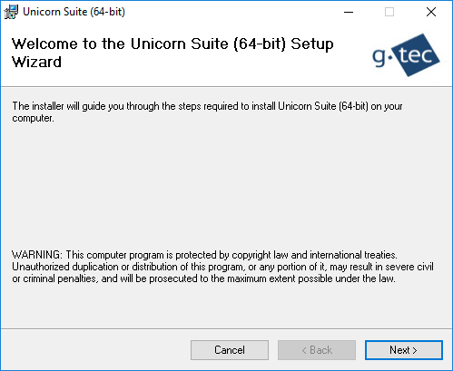

# Installation
The following section describes how to install Unicorn Suite.

[Install Unicorn Suite Hybrid Black](#install-unicorn-suite-hybrid-black) <br/>

[Uninstall Unicorn Suite Hybrid Black](#uninstall-unicorn-suite-hybrid-black)

## Install Unicorn Suite Hybrid Black
Perform the following steps for installation:
1. If there is an old version of the Unicorn Suite package on the computer, please uninstall it.
2. Close all running applications.
3. Open the Unicorn Suite directory, select the correct directory for the architecture of the PC (Win64). To install the Unicorn Suite, run setup.exe. If setup asks you for installation of the .NET Framework, confirm the dialog by clicking the Accept button. The installer will install the .NET Framework.
4. Follow the instructions on the screen. If User Account Control is turned on, additional dialogs may ask for permission. Confirm the dialogs to allow installation of the Unicorn Suite software through User Account Control.
    <p align="center">
    <br/>
    </p>
5. Choose the installation folder (default is ```C:\Program Files\gtec\```) where the install routine copies all necessary driver files and press Next.
6. Follow the instructions on the screen. When the following window informs you about completion of the installation, click Close to complete.

## Uninstall Unicorn Suite Hybrid Black
Remove Unicorn Suite using the standard uninstall process of Windows accessed via the Control Panel.