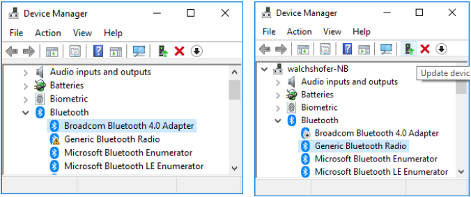
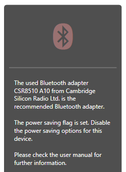
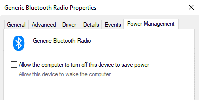
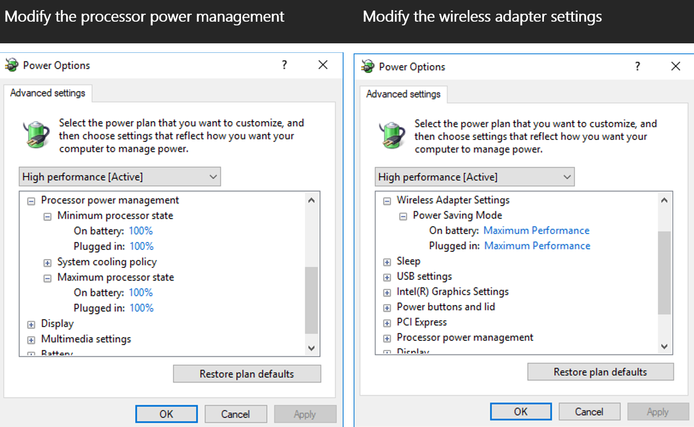
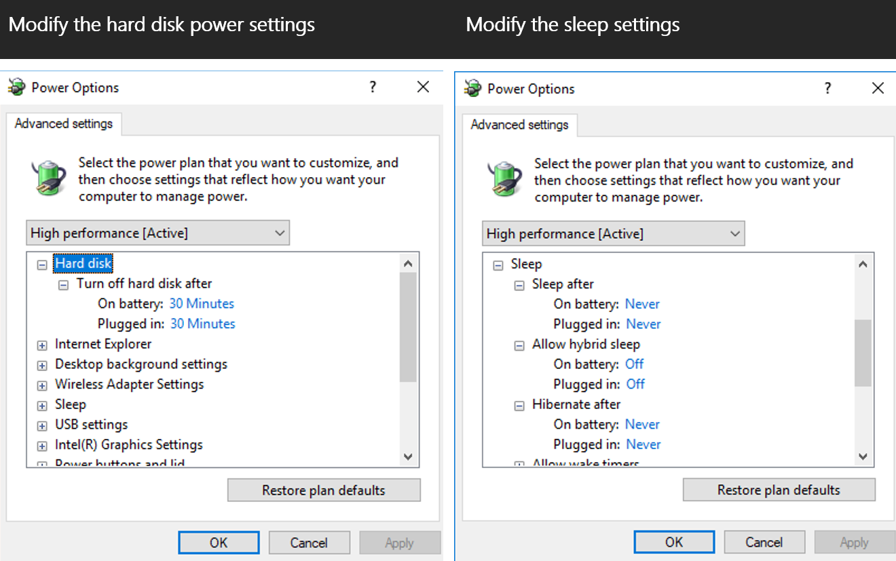
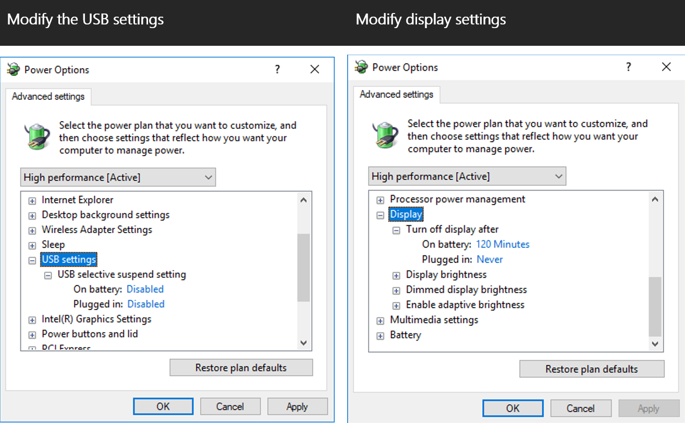

# Soft Prerequisites

## Bluetooth Configuration
Most computers are delivered with an internal Bluetooth adapter. The Unicorn Brain Interface is tested and delivered with a recommended Unicorn Bluetooth adapter. To avoid data loss and unexpected behavior, the Unicorn Brain Interface should be used with the Unicorn Bluetooth dongle. Insert the Unicorn Bluetooth dongle into an USB slot and open the Unicorn Suite. Open the “My Unicorn” tab.
- If the Bluetooth symbol is colored green, the recommended Bluetooth adapter is in use and configured properly.
- If the Bluetooth symbol is blinking red, either the wrong Bluetooth adapter is used or it is not configured correctly.
- The delivered Bluetooth dongle should be named “CSR8510 A10”.

 

### Switch Bluetooth Dongle
Open the “Device Manager” and go to the Bluetooth section. The Unicorn Bluetooth dongle should be listed as “Generic Bluetooth Radio”. If the Generic Bluetooth Radio symbol features a small warning sign, the Unicorn Brain Interface is not in use or not working properly.

If there are multiple Bluetooth devices, the computer has an internal Bluetooth adapter, which is currently in use. Disable the internal Bluetooth adapter by right clicking the device and selecting “Disable device”. Reinject the Unicorn Bluetooth dongle. The Unicorn Bluetooth dongle should be used now.

 

### Disable Bluetooth Power Saving Mode
Open the Unicorn Suite and go to the “My Unicorn” tab if the delivered Bluetooth dongle is in use. The delivered Bluetooth dongle should be named “CSR8510 A10”. If the delivered dongle is in use but still blinking red, the power saving mode is enabled.

 

Open the “Device Manager” and go to the Bluetooth section. Open the Bluetooth properties of the “Generic Bluetooth Radio”. Go to the “Power Management” tab. Deselect the “Allow the computer to turn off this device to save power” option to disable the power saving mode.

 

**Note:**
Do not use any other Bluetooth dongle than the Unicorn Bluetooth dongle.

## Optimize the Power Plan
To ensure that the computer does not go to sleep or hibernate while acquiring data or performing a paradigm, the “Power Options” should be optimized. Modify the power plan settings as following: 

 

 

 

