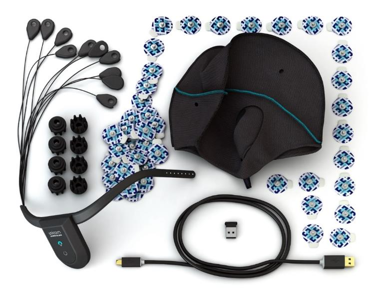
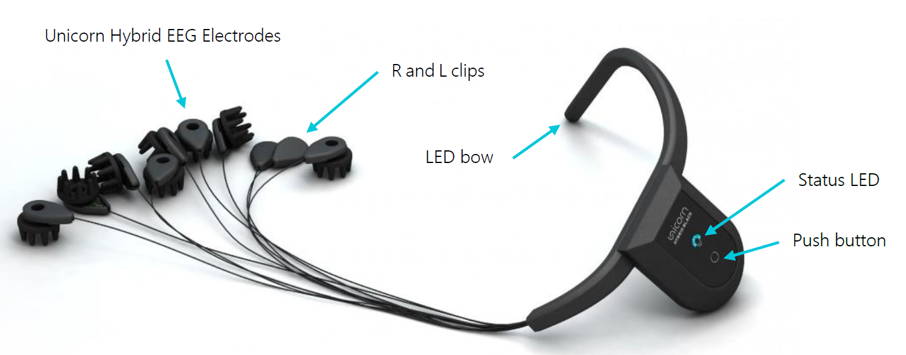
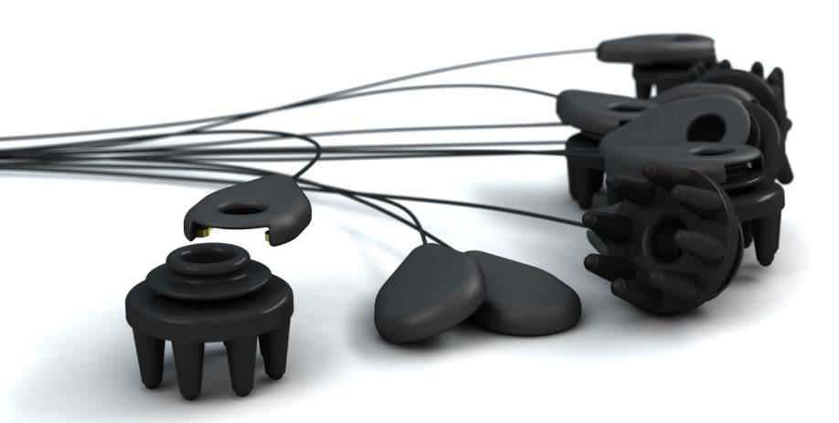
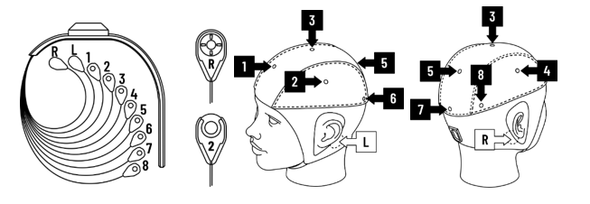
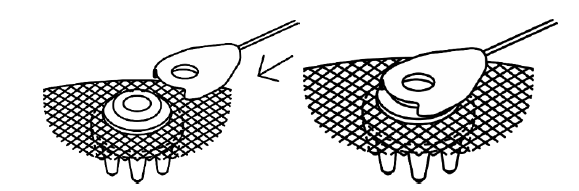
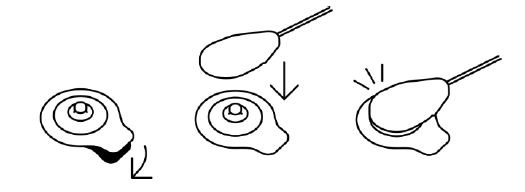

# Unicorn Suite Hybrid Black User Manual
This repository is the User Manual for Unicorn Brain Interface Hybrid Black.

Copyright © 2021 g.tec neurotechnology GmbH Austria

For more information, visit: [Unicorn Brain Interface webpage](www.unicorn-bi.com)

Contact email: hello@unicorn-bi.com

### [Glossary](Glossary/glossaryInformation.md)

### [Safety Notice](Safety/safetyNotice.md)

# Introduction
The Unicorn Brain Interface is a consumer grade biosignal amplifier kit. It allows developers, artists and makers to integrate signals from the human body within their projects – ranging from simple display of the signals to designing and controlling attached devices and interacting with artistic installations, toys, computer programs or apps and more. The Unicorn Brain Interface acquires the EEG from eight Unicorn Hybrid EEG Electrodes. The Unicorn Brain Interface consists of the Unicorn Brain Interface Hybrid Black, Unicorn C Size M, Unicorn Hybrid EEG Electrodes, Unicorn USB Charging Cable and a Unicorn Bluetooth dongle to acquire data on a computer. The Unicorn Suite is the software environment, consisting of standalone applications and APIs to interface the Unicorn Brain Interface, acquire and process data and to perform BCI paradigms.

## Highlights
- EEG recordings without cable connection via radio signal
- Bluetooth 2.1 interface
- Hybrid electrodes for wet and dry measurements
- 8 DC-coupled analog input channels with 24 Bit resolution
- sampling rate of 250 Hz per channel
- oversampling to achieve a high signal-to-noise ratio
- input sensitivity of ± 750 mV
- 3-axis accelerometer
- 3-axis gyroscope

## Intended use
The Unicorn Brain Interface is intended for use in non-medical environment for non-medical applications. The Unicorn Brain Interface is used by developers, artists, makers and gamers in the user’s environment.

## Release notes
|Version Name|Version Number|Date|Change|
|-|-|-|-|
|Unicorn Hybrid Black|1.18.00|11/15/21|Initial Release|

## Conditions of use
### Operation and storage

 Temperature: +5 to +40 °C

 Relative humidity: 25 to 80 %, non-condensing

 Atmospheric pressure: 700 to 1060 hPa

# Unicorn Hybrid Black

<table>
    <tr>
        <th>Bundle components</th>
        <th>Quantity</th>
    </tr>
    <tr>
        <td>Unicorn Brain Interface Hybrid Black	</td>
        <td>1</td>
    </tr>
    <tr>
        <td>Unicorn USB Charging Cable	</td>
        <td>1</td>
    </tr>
    <tr>
        <td>Unicorn Hybrid EEG Electrodes	</td>
        <td>8</td>
    </tr>
    <tr>
        <td>Unicorn Sticky Electrodes</td>
        <td>50</td>
    </tr>
    <tr>
        <td>Unicorn Cap Size M	</td>
        <td>1</td>
    </tr>
    <tr>
        <td>Unicorn Bluetooth Dongle</td>
        <td>1</td>
    </tr>
    <tr>
        <td>Unicorn Box	</td>
        <td>1</td>
    </tr>
        <tr>
        <td>Unicorn Suite Hybrid Black</td>
        <td>1</td>
    </tr>
</table>

 

## Unicorn Brain Interface Hybrid Black

 

### Status LED
The color of the Status LED shows the actual battery voltage measured by the Unicorn Brain Interface.

<table>
    <tr>
        <th>Status LED</th>
        <th>Battery Status</th>
    </tr>
    <tr>
        <td>Cyan</td>
        <td>Battery OK</td>
    </tr>
    <tr>
        <td>Yellow</td>
        <td>Battery Low</td>
    </tr>
    <tr>
        <td>Red</td>
        <td>Empty</td>
    </tr>
    <tr>
        <td>Green</td>
        <td>Charging</td>
    </tr>
</table>

The Status LED shows the actual operation mode of the Unicorn Brain Interface.

<table>
    <tr>
        <th>Status LED</th>
        <th>Operation Mode</th>
    </tr>
    <tr>
        <td>Flashing</td>
        <td>Bluetooth connection closed</td>
    </tr>
    <tr>
        <td>Slow Blinking</td>
        <td>Bluetooth connection established</td>
    </tr>
    <tr>
        <td>Continuous</td>
        <td>Acquisition running</td>
    </tr>
    <tr>
        <td>Off</td>
        <td>Device off and/or charging completed</td>
    </tr>
</table>

### Push button
- Pressing the pushbutton for more than 2 seconds turns the Unicorn Brain Interface ON if it is OFF.
- Pressing the pushbutton for more than 2 seconds turns the Unicorn Brain Interface OFF if it is ON.

**Note**:

If the Status LED is RED, the Unicorn Brain Interface does not turn on.

### LED Bow
The LED bow comprises 8 LEDs that can be controlled with Unicorn APIs:
- Setting the digital output high turns the LED on
- Setting the digital output low turns the LED off

### Magnetic Docking Station
The Unicorn Brain Interface is attached to the Unicorn Cap by a magnetic docking station. To disassemble the Unicorn Brain Interface from the Unicorn cap, just lift it off the docking station. Be careful not to pull on the electrode leads.

For reassembly, just bring the Unicorn Brain Interface in the vicinity of the docking station and it will attach and center by itself. It is not possible to attach it upside down.

### Symbols

<table>
    <tr>
        <th>Symbol</th>
        <th>Description</th>
    </tr>
    <tr>
        <td></td>
        <td>CE mark</td>
    </tr>
    <tr>
        <td></td>
        <td>Do not dispose with domestic waste. Dispose of it via the separate collection system for electrical and electronic equipment.</td>
    </tr>
    <tr>
        <td></td>
        <td>Avoid electrostatic discharge</td>
    </tr>
    <tr>
        <td></td>
        <td>Follow instructions for use</td>
    </tr>
    <tr>
        <td></td>
        <td>Manufacturer</td>
    </tr>
    <tr>
        <td></td>
        <td>S1: permanent operation</td>
    </tr>
    <tr>
        <td></td>
        <td>Serial number in the format: UN-YearOfProduction.Month.Number</td>
    </tr>
    <tr>
        <td></td>
        <td>Contains FCC ID: QOQWT12</td>
    </tr>
    <tr>
        <td></td>
        <td>Contains IC: 5123A-BGTWT12A</td>
    </tr>
</table>

## Unicorn Hybrid EEG Electrodes
The Unicorn Hybrid EEG Electrodes are made of a conductive rubber that allow their operation as dry or wet Unicorn Hybrid EEG Electrodes.

 

Dry Unicorn Hybrid EEG Electrodes have the advantage of fast and easy preparation, but sometimes suffer from poor signal quality. If you encounter poor signal quality, the Unicorn Hybrid EEG Electrode can be used with special Unicorn Gel to reach the performance of a wet electrode.

To connect or disconnect the clip connector to/from the Unicorn Hybrid EEG Electrode, just slide it on or off.

## Assembling / Disassembling
The Unicorn Brain Interface is delivered disassembled. The system must be assembled properly to measure EEG. The following section describes how to assemble or disassemble the Unicorn.

### Insert / Remove Unicorn Hybrid EEG Electrodes
The Unicorn cap features eight holes for holding eight Unicorn Hybrid EEG Electrodes. The first groove of the electrode is used to attach the electrode connector clip. The second groove is provided to insert and hold the electrode within a Unicorn cap. Stretch one of the predefined electrode holes of the Unicorn cap and insert the electrode until the second groove of the electrode is surrounded by fabric. Insert all eight Unicorn Hybrid EEG Electrodes into the predefined positions of the Unicorn cap.

 

### Connect / Disconnect Unicorn Hybrid EEG Electrodes
The bottom of each clip connector has a number or letter with the correct position. Attach the clip connectors numbered 1-8 by sliding them onto the first notch of the corresponding mounted Unicorn Hybrid EEG Electrodes on the cap. The following pictures show the correct positions of the electrode clips on the cap. The predefined electrode positions of the cap are Fz, C3, Cz, C4, Pz, PO7, Oz and PO8 according to the 10/20 system. The positions marked as L (for left) and R (for right) are for the Unicorn Sticky Electrodes and will be described in the following chapter.

 

To connect or disconnect the clip connector to/from the Unicorn Hybrid EEG Electrode, just slide the clip connector on or off. Make sure that the clip surrounds the first groove of the electrode and that the holes of the electrode and electrode clip overlap.

 

### Attach / Detach Unicorn Sticky Electrodes
R and L electrode feature a clip connector to attach or detach disposable Unicorn Sticky Electrodes. Put a Unicorn Sticky Electrode on each of the mastoid bones behind your ears (L and R positions seen in the figure above). Click the L and R electrode clips onto the corresponding Unicorn Sticky Electrodes. Remove the disposable Unicorn Sticky Electrodes by pulling the R and L clip connectors until the electrode is detached from the clip connector.

 

## Programming Interfaces
[Unicorn APIs](https://github.com/unicorn-bi/Unicorn-Hybrid-Black-Windows-APIs) 

&nbsp;&nbsp;&nbsp;[Unicorn C API](https://github.com/unicorn-bi/Unicorn-Hybrid-Black-Windows-APIs/blob/main/c-api/unicorn-c-api.md) 

&nbsp;&nbsp;&nbsp;[Unicorn .NET API](https://github.com/unicorn-bi/Unicorn-Hybrid-Black-Windows-APIs/blob/main/dotnet-api/unicorn-dotnet-api.md) 

&nbsp;&nbsp;&nbsp;[Unicorn Python API](https://github.com/unicorn-bi/Unicorn-Hybrid-Black-Windows-APIs/blob/main/python-api/unicorn-python-api.md) 

&nbsp;&nbsp;&nbsp;[Unicorn Simulink Interface](https://github.com/unicorn-bi/Unicorn-Hybrid-Black-Windows-APIs/blob/main/simulink-interface/unicorn-simulink-interface.md) 

[Unicorn Network Interfaces](https://github.com/unicorn-bi/Unicorn-Network-Interfaces-Hybrid-Black/tree/main) 

&nbsp;&nbsp;&nbsp;[Unicorn LSL](https://github.com/unicorn-bi/Unicorn-Network-Interfaces-Hybrid-Black/tree/main/LSL) 

&nbsp;&nbsp;&nbsp;[Unicorn UDP](https://github.com/unicorn-bi/Unicorn-Network-Interfaces-Hybrid-Black/tree/main/UDP) 

## Applications

[Unicorn Bandpower](https://github.com/unicorn-bi/Unicorn-Bandpower-Hybrid-Black) 

[Unicorn Blondy Check](https://github.com/unicorn-bi/Unicorn-Hybrid-Black-Windows-APIs) 