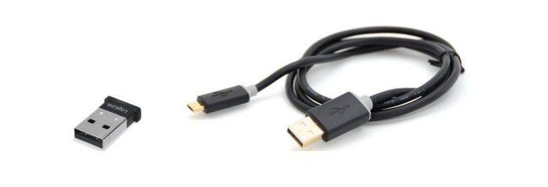

# Unicorn Suite Hybrid Black User Manual
This repository is the User Manual for Unicorn Brain Interface Hybrid Black.

Copyright © 2021 g.tec neurotechnology GmbH Austria

For more information, visit: [Unicorn Brain Interface webpage](www.unicorn-bi.com)

Contact email: hello@unicorn-bi.com

### [Glossary](Glossary/glossaryInformation.md)

### [Safety Notice](Safety/safetyNotice.md)

# Introduction
The Unicorn Brain Interface is a consumer grade biosignal amplifier kit. It allows developers, artists and makers to integrate signals from the human body within their projects – ranging from simple display of the signals to designing and controlling attached devices and interacting with artistic installations, toys, computer programs or apps and more. The Unicorn Brain Interface acquires the EEG from eight Unicorn Hybrid EEG Electrodes. The Unicorn Brain Interface consists of the Unicorn Brain Interface Hybrid Black, Unicorn C Size M, Unicorn Hybrid EEG Electrodes, Unicorn USB Charging Cable and a Unicorn Bluetooth dongle to acquire data on a computer. The Unicorn Suite is the software environment, consisting of standalone applications and APIs to interface the Unicorn Brain Interface, acquire and process data and to perform BCI paradigms.

## Highlights
- EEG recordings without cable connection via radio signal
- Bluetooth 2.1 interface
- Hybrid electrodes for wet and dry measurements
- 8 DC-coupled analog input channels with 24 Bit resolution
- sampling rate of 250 Hz per channel
- oversampling to achieve a high signal-to-noise ratio
- input sensitivity of ± 750 mV
- 3-axis accelerometer
- 3-axis gyroscope

## Intended use
The Unicorn Brain Interface is intended for use in non-medical environment for non-medical applications. The Unicorn Brain Interface is used by developers, artists, makers and gamers in the user’s environment.

## Release notes
|Version Name|Version Number|Date|Change|
|-|-|-|-|
|Unicorn Hybrid Black|1.18.00|11/15/21|Initial Release|

## Conditions of use
### Operation and storage

 Temperature: +5 to +40 °C

 Relative humidity: 25 to 80 %, non-condensing

 Atmospheric pressure: 700 to 1060 hPa

# Unicorn Hybrid Black

<table>
    <tr>
        <th>Bundle components</th>
        <th>Quantity</th>
    </tr>
    <tr>
        <td>Unicorn Brain Interface Hybrid Black	</td>
        <td>1</td>
    </tr>
    <tr>
        <td>Unicorn USB Charging Cable	</td>
        <td>1</td>
    </tr>
    <tr>
        <td>Unicorn Hybrid EEG Electrodes	</td>
        <td>8</td>
    </tr>
    <tr>
        <td>Unicorn Sticky Electrodes</td>
        <td>50</td>
    </tr>
    <tr>
        <td>Unicorn Cap Size M	</td>
        <td>1</td>
    </tr>
    <tr>
        <td>Unicorn Bluetooth Dongle</td>
        <td>1</td>
    </tr>
    <tr>
        <td>Unicorn Box	</td>
        <td>1</td>
    </tr>
        <tr>
        <td>Unicorn Suite Hybrid Black</td>
        <td>1</td>
    </tr>
</table>

 

## Unicorn Brain Interface Hybrid Black

 

### Status LED
The color of the Status LED shows the actual battery voltage measured by the Unicorn Brain Interface.

<table>
    <tr>
        <th>Status LED</th>
        <th>Battery Status</th>
    </tr>
    <tr>
        <td>Cyan</td>
        <td>Battery OK</td>
    </tr>
    <tr>
        <td>Yellow</td>
        <td>Battery Low</td>
    </tr>
    <tr>
        <td>Red</td>
        <td>Empty</td>
    </tr>
    <tr>
        <td>Green</td>
        <td>Charging</td>
    </tr>
</table>

The Status LED shows the actual operation mode of the Unicorn Brain Interface.

<table>
    <tr>
        <th>Status LED</th>
        <th>Operation Mode</th>
    </tr>
    <tr>
        <td>Flashing</td>
        <td>Bluetooth connection closed</td>
    </tr>
    <tr>
        <td>Slow Blinking</td>
        <td>Bluetooth connection established</td>
    </tr>
    <tr>
        <td>Continuous</td>
        <td>Acquisition running</td>
    </tr>
    <tr>
        <td>Off</td>
        <td>Device off and/or charging completed</td>
    </tr>
</table>

### Push button
- Pressing the pushbutton for more than 2 seconds turns the Unicorn Brain Interface ON if it is OFF.
- Pressing the pushbutton for more than 2 seconds turns the Unicorn Brain Interface OFF if it is ON.

**Note**:

If the Status LED is RED, the Unicorn Brain Interface does not turn on.

### LED Bow
The LED bow comprises 8 LEDs that can be controlled with Unicorn APIs:
- Setting the digital output high turns the LED on
- Setting the digital output low turns the LED off

### Magnetic Docking Station
The Unicorn Brain Interface is attached to the Unicorn Cap by a magnetic docking station. To disassemble the Unicorn Brain Interface from the Unicorn cap, just lift it off the docking station. Be careful not to pull on the electrode leads.

For reassembly, just bring the Unicorn Brain Interface in the vicinity of the docking station and it will attach and center by itself. It is not possible to attach it upside down.

### Symbols

<table>
    <tr>
        <th>Symbol</th>
        <th>Description</th>
    </tr>
    <tr>
        <td></td>
        <td>CE mark</td>
    </tr>
    <tr>
        <td></td>
        <td>Do not dispose with domestic waste. Dispose of it via the separate collection system for electrical and electronic equipment.</td>
    </tr>
    <tr>
        <td></td>
        <td>Avoid electrostatic discharge</td>
    </tr>
    <tr>
        <td></td>
        <td>Follow instructions for use</td>
    </tr>
    <tr>
        <td></td>
        <td>Manufacturer</td>
    </tr>
    <tr>
        <td></td>
        <td>S1: permanent operation</td>
    </tr>
    <tr>
        <td></td>
        <td>Serial number in the format: UN-YearOfProduction.Month.Number</td>
    </tr>
    <tr>
        <td></td>
        <td>Contains FCC ID: QOQWT12</td>
    </tr>
    <tr>
        <td></td>
        <td>Contains IC: 5123A-BGTWT12A</td>
    </tr>
</table>

## Unicorn Hybrid EEG Electrodes
The Unicorn Hybrid EEG Electrodes are made of a conductive rubber that allow their operation as dry or wet Unicorn Hybrid EEG Electrodes.

 

Dry Unicorn Hybrid EEG Electrodes have the advantage of fast and easy preparation, but sometimes suffer from poor signal quality. If you encounter poor signal quality, the Unicorn Hybrid EEG Electrode can be used with special Unicorn Gel to reach the performance of a wet electrode.

To connect or disconnect the clip connector to/from the Unicorn Hybrid EEG Electrode, just slide it on or off.

## Assembling / Disassembling
The Unicorn Brain Interface is delivered disassembled. The system must be assembled properly to measure EEG. The following section describes how to assemble or disassemble the Unicorn.

### Insert / Remove Unicorn Hybrid EEG Electrodes
The Unicorn cap features eight holes for holding eight Unicorn Hybrid EEG Electrodes. The first groove of the electrode is used to attach the electrode connector clip. The second groove is provided to insert and hold the electrode within a Unicorn cap. Stretch one of the predefined electrode holes of the Unicorn cap and insert the electrode until the second groove of the electrode is surrounded by fabric. Insert all eight Unicorn Hybrid EEG Electrodes into the predefined positions of the Unicorn cap.

 

### Connect / Disconnect Unicorn Hybrid EEG Electrodes
The bottom of each clip connector has a number or letter with the correct position. Attach the clip connectors numbered 1-8 by sliding them onto the first notch of the corresponding mounted Unicorn Hybrid EEG Electrodes on the cap. The following pictures show the correct positions of the electrode clips on the cap. The predefined electrode positions of the cap are Fz, C3, Cz, C4, Pz, PO7, Oz and PO8 according to the 10/20 system. The positions marked as L (for left) and R (for right) are for the Unicorn Sticky Electrodes and will be described in the following chapter.

 

To connect or disconnect the clip connector to/from the Unicorn Hybrid EEG Electrode, just slide the clip connector on or off. Make sure that the clip surrounds the first groove of the electrode and that the holes of the electrode and electrode clip overlap.

 

### Attach / Detach Unicorn Sticky Electrodes
R and L electrode feature a clip connector to attach or detach disposable Unicorn Sticky Electrodes. Put a Unicorn Sticky Electrode on each of the mastoid bones behind your ears (L and R positions seen in the figure above). Click the L and R electrode clips onto the corresponding Unicorn Sticky Electrodes. Remove the disposable Unicorn Sticky Electrodes by pulling the R and L clip connectors until the electrode is detached from the clip connector.

 

### Attach / Detach Unicorn Brain Interface on the cap
The Unicorn Brain Interface is attached to the Unicorn Cap by a magnetic docking station. To disassemble the Unicorn Brain Interface from the Unicorn cap, just lift it off the docking station. Be careful not to pull on the electrode leads. For reassembly, just bring the Unicorn Brain Interface in the vicinity of the docking 
station and it will attach and center by itself. It is not possible to attach it upside down.

 

## Charging the Unicorn Brain Interface
For charging, lift off the Unicorn Brain Interface from the docking station to reach the USB port. Connect the provided Unicorn USB Charging Cable to the USB port of the Unicorn Brain Interface and to a free USB port of a PC, Notebook or appropriate wall adapter. Charging starts automatically. The accumulator cannot be overcharged, so the Unicorn Brain Interface can be connected to the supply mains without being damaged. When charging the Unicorn Brain Interface, the Status LED shines green. Charging is completed when the Status LED goes off.

**Notes**:
- The Unicorn has a built-in Lithium-Polymer accumulator. The accumulator may be partly discharged when the system is delivered.
- As long as the USB port of the Unicorn Brain Interface is connected to a working USB port of a PC, Notebook or appropriate wall adapter, the Unicorn Brain Interface can’t be turned on.
- Charging an empty Unicorn battery will take about 3 hours.

**Warnings**:
- Do not over-discharge the Unicorn battery. Over-discharging can damage the Unicorn
battery or reduce the performance and life-time.
- The Unicorn cell/battery would be at an over-discharged state by its self-discharge characteristics if the cell is not used for long time. Over long storage periods, batteries should be cycled every 90 days.
- Store in a 50 % charged state. Do not store at fully charged state (4.2V) for a long period of time.
- Expected Unicorn battery life cycle: The capacity after 300 cycles is expected to be equal to or more than 80 % of the rated capacity. The capacity after 500 cycles is expected to be equal to or more than 60 % of the rated capacity.
- Operating Temperature
    - Charging: 0 °C to 45 °C
    - Discharging: -20 °C to 60 °C
- Storage Temperature
    - 1 year at -10 °C to 25 °C
- Electrical Specifications for charging
    - Voltage nominal input: 5 V DC
    - Voltage input min/max: 4.25 V - 7 V
    - Power input: 5 W

## Safety Operation
**Warnings:**
- Use on healthy, intact skin only. Make sure no force is applied onto the Unicorn Hybrid EEG Electrodes to avoid any harm to the user.
- Do not use on or near open wounds, bruised or weakened skin, whether due to injury and/or other medical conditions of the subject.
- Do not use on subjects with a history of skin allergies or sensitivity to cosmetics and lotions.
- If rash, redness, itching, swelling, or abnormality appears on skin, remove the Unicorn cap and wash any residual Unicorn Gel off immediately.
- Instruct subjects to communicate any persistent redness, soreness or swelling at the Unicorn Hybrid EEG Electrodes sites.
- The Unicorn Cap should not be left in place for longer than three hours for any single recording session.
- Avoid eye contact with Unicorn Gel, as it may cause mild transient irritation. Wash eyes with appropriate 0.9 % saline solution, commercial eye wash solution or water to flush out residual particles. Avoid rubbing eyes.
- Unicorn Gel is essentially non-toxic; however, ingestion could result in nausea, vomiting and/ or diarrhea. Drink 1 to 2 glasses of water if ingested.
- Electrostatic discharge (ESD) events can harm electronic components inside your Unicorn Brain Interface. Under certain conditions, electric charge may build up on your body or an object, such as a peripheral, and then discharge into another object, such as your Unicorn Brain Interface. To prevent ESD damage, you should discharge static electricity from your body before you interact with any of your devices. You can protect against ESD and discharge static electricity from your body by touching a metal grounded object.

## Setup the Unicorn Brain Interface to record data

### Put the Unicorn Brain Interface on the subject's head
Place the Unicorn Cap with the Unicorn Brain Interface on the subject’s head to position the Unicorn Hybrid EEG Electrodes according to the electrode positions. Use a Unicorn Cap (S, M or L) that provides gentle pressure to all Unicorn Hybrid EEG Electrodes on the skin without causing pain to the subject. To properly 
mount the Unicorn Cap, measure the distance between the nasion and inion and the distance between the left and right preauricular points of the subject. The position at the middle of these two locations is the vertex position, position 3. Put on the Unicorn Cap and align this measured position with the position 3 of 
the Unicorn Cap. Now, the Unicorn Cap is in the correct position. Fix the Unicorn Cap with the chin strap to keep it in place.

### Prepare the Unicorn Hybrid EEG electrodes
The Unicorn Hybrid EEG Electrodes are attached to the Unicorn Cap. Before attaching the Unicorn Sticky Electrodes to the left (L) and right (R) bones behind the ears (processus mastoideus), the skin behind the ears should be cleaned with a soft cloth and a bit of medical alcohol (70 %). Connect the R (right mastoid) and the L (left mastoid) connectors to the Unicorn Sticky Electrodes.

After putting on and positioning the Unicorn Cap, each Unicorn Hybrid EEG Electrode needs to be twisted clockwise and counterclockwise a few times with slight pressure on the skin. Just grab the Unicorn Hybrid EEG Electrodes with two fingers from outside the Unicorn Cap to do so. This allows the pins to go through 
the hair and get in good contact with the skin

 

After preparation of all Unicorn Hybrid EEG Electrodes, it might take 2-3 minutes until all channels display stable signals. If some Unicorn Hybrid EEG Electrodes do not show stable signals after a few minutes, you may need to repeat the twisting and/or check the environment and the correct pressure of all Unicorn Hybrid EEG Electrodes on the skin. To see clear EEG signals, it is recommended to use a bandpass filter (0.5 – 30 Hz or 2 – 30 Hz) and a 50/60 Hz notch filter.

 

**Note:**

EEG recordings in general are quite sensitive to a number of disturbing influences such as movements of the subject, the cables and the Unicorn Hybrid EEG Electrodes, or coupling of electromagnetic and electrostatic fields near the recording environment. For dry recordings especially, movements of the Unicorn Hybrid EEG Electrodes and electrostatic charges can cause significant artefacts in the signals.

### Avoid electrode and cable movements
- Ensure the subject is in a comfortable and relaxed position during recording.
- Instruct the subject to stay in a relaxed position and to avoid movements.
- Position electrode wires to avoid tension and direct contact with moving parts of the body or any other moving components, such as devices near the head.

### Avoid Electrostatic Charges
- Choose an antistatic environment/lab for high quality recordings.
- Use a room with antistatic carpet or floor covering or wooden/stone floor instead of normal carpets or artificial parquet foors.
- Furniture made of wood, metal and leather is preferable to any plastic materials and synthetic textiles.
- Cotton clothing is preferred to wool and synthetics.
- Avoid shoes with synthetic soles.

### Grounding
- Grounding of any additional equipment (using a potential equalization conductor) and metal-made furniture to a central earth/ground contact (lab ground) is recommended.
- The subject as well as the operator(s) may be grounded to avoid electrostatic charges (e.g. using an antistatic wrist band connected to the lab ground).

 

### Switch off
After stopping the data acquisition, you can turn off the Unicorn Brain Interface by again pressing the power button for at least 2 seconds. The LED should turn off and remain off.

### Cleaning
Clean the Unicorn Cap and the Unicorn Hybrid EEG Electrodes immediately after use. Read cleaning instructions in the following chapter.

### Packing and storage
Never pack the system while any of the components remain wet or moist! Always allow all components to dry completely before packing or storage to avoid damage to the system. When packing the Unicorn Brain Interface in the protective case, make sure that no wires are being pinched or kinked.

## Cleaning the Unicorn Brain Interface
**Note:**
- When the EEG recording is finished, remove the Unicorn Cap and L and R clip connectors from the Unicorn Sticky Electrodes. Wipe the subject’s forehead and mastoids with a tissue or cloth towel, and lightly wipe the hair. Brushing or combing the hair will remove all visual evidence of the Unicorn Gel.
- The Unicorn Caps do not have an expiration date, aside from elasticity. Elasticity of the material dictates the life time of the Unicorn Cap. When a Unicorn Cap becomes stretched, it loses its elasticity. It must then be discarded and replaced, as the Unicorn Hybrid EEG Electrode placements will be inaccurate and artifacts may occur more often.
- Keep the Unicorn Brain Interface away from any liquids! Liquids must not enter the Unicorn Brain Interface!
- During cleaning and disinfection, the USB cable must be disconnected from the Unicorn Brain Interface.
- Please note that devices that blow warm or hot air, such as hand or hair dryers, must not be used to dry Unicorn Caps, because it weakens the elastic material; the Unicorn Cap lifetime will be greatly shortened. Hanging the Unicorn Cap in front of a fan will accelerate drying.
- Take care that the Unicorn Hybrid EEG Electrodes leads are not damaged during cleaning!
- Do not use excessive force while cleaning. 
- The Unicorn Brain Interface must not come in contact with germicide.
- It is the user’s responsibility to qualify any deviations from the recommended method of processing. Users should note appropriate disclaimers if there are deviations. The manufacturer assumes no responsibility for damage to its products caused by the use of products or processes not recommended in this policy.
- If questions arise, or more information is needed, please contact the manufacturer.

### Cleaning the Unicorn Brain Interface and Unicorn Hybrid EEG electrode cables
Whenever the Unicorn Brain Interface after usage gets in contact with Unicorn Gel or other substances, it should be cleaned immediately. Use a damp cloth to clean the Unicorn Brain Interface. Do not submerge the Unicorn Brain Interface in water and prevent any liquids from entering the Unicorn Brain Interface! For disinfection, use cleaning and disinfection wipes (e.g. Mikrozid® sensitive wipes #70000807, Mikrozid® AF wipes #109203 from Schülke & Mayr GmbH, www.schuelke.com, or similar products).

**Note:**

The Unicorn Brain Interface and all cables coming with the system must not be submerged in liquids! Use disinfection wipes only to clean and disinfect these parts of the system.

### Cleaning the Unicorn cap and Unicorn Hybrid EEG electrodes
When used for dry EEG recordings, the Unicorn Hybrid EEG Electrodes can be cleaned without removing them from the Unicorn cap. For this purpose, use a soft cloth and 70 % isopropyl alcohol or disinfection wipes, as mentioned above. Clean the pins of all Unicorn Hybrid EEG Electrodes by wiping from different directions over the tips of the pins. When used as a wet electrode system, clean all Unicorn Hybrid EEG 
Electrodes inside and outside with a brush, until gel is removed.

For cleaning and disinfection of the Unicorn Cap, the Unicorn Hybrid EEG Electrodes may remain in the Unicorn Cap. The Unicorn Cap itself can be cleaned in warm water (30 – 35 °C) with some shampoo, soap or multistage enzymatic cleaner (e.g. Sekusept® MultiEnzyme P #3046670 from ECOLAB, www.ecolab.com, or a comparable product).

Do not soak the Unicorn Cap for more than 10 minutes, and rinse it carefully with clear water after cleaning. For disinfection, use a low-level disinfectant based on Glucoprotamin (e.g. Sekusept® PLUS #3011100 from ECOLAB, www.ecolab.com, or a similar product). Follow the instructions from the manufacturer of the specific product you use regarding concentration and duration of the treatment. Use the lowest possible concentration and the shortest treatment time to keep the Unicorn cap in a good condition for a long time.

**Note:**

The clip connectors should not be submerged in disinfectant or other liquids. Use 
disinfection wipes to disinfect these parts of the system!

### Drying Unicorn caps and Unicorn Hybrid EEG electrodes
Rinse the Unicorn Cap carefully with clear water after cleaning. Then, put one towel inside the Unicorn Cap and another one around the outside of the Unicorn Cap. The towels will soak up most of the liquid and allow the Unicorn Cap and Unicorn Hybrid EEG Electrodes to dry quickly. Put the Unicorn Cap in a well-ventilated place to dry.

Follow these rules to keep the Unicorn Cap in good condition for a long time:
- Do not dry the Unicorn Cap in a stretched position, as it might lose elasticity.
- Do not use hot air (e.g. from a hair dryer) to speed up drying.
- Do not put the Unicorn Cap in a laundry dryer
- Do not iron the Unicorn Cap
- Never pack and store a Unicorn Cap before it completely dries.

**Note:**

The Unicorn Caps may bleach out a bit after frequent cleaning and disinfection. As long as the fabric remains elastic and the signs on the Unicorn cap are readable, replacement is not necessary. However, Unicorn Caps and Unicorn Hybrid EEG Electrodes are consumables and need to be replaced from time to time. Careful treatment and cleaning will prolong the life-time of your Unicorn Caps and Unicorn Hybrid EEG Electrodes significantly.

# Unicorn Nake BCI
The Unicorn Naked BCI allows you to build your own EEG head-set and BCI applications with high-performance hardware and open-source tools within hours. The only difference from the Unicorn Hybrid Black is that the Unicorn Naked BCI comes without a casing.

<table>
    <tr>
        <th>Bundle components</th>
        <th>Quantity</th>
    </tr>
    <tr>
        <td>Unicorn Naked BCI </td>
        <td>1</td>
    </tr>
    <tr>
        <td>Unicorn USB Charging Cable</td>
        <td>1</td>
    </tr>
    <tr>
        <td>Unicorn Hybrid EEG Electrodes</td>
        <td>8</td>
    </tr>
    <tr>
        <td>Unicorn Sticky Electrodes</td>
        <td>50</td>
    </tr>
    <tr>
        <td>Unicorn Bluetooth Dongle</td>
        <td>1</td>
    </tr>
    <tr>
        <td>Unicorn Box</td>
        <td>1</td>
    </tr>
    <tr>
        <td>Unicorn Suite Hybrid Black</td>
        <td>1</td>
    </tr>
</table>

 

 

# General notes:

## Classification
- Protection against mechanical distortion and liquids: IP40
- Operation mode: S1 (Permanent operation)

## Transportation and storage conditions
The Unicorn Brain Interface can be stored at temperatures between –20° to +45° Celsius. The relative humidity must be between 25 % and 80 %. If there is any condensed water, wait until it disappears before use (wait at least 1 h in a heated room).

## Location details
Do not use the Unicorn Brain Interface near a heating system or directly in the sun. During operation, the outside temperature should be between +5 Celsius and +35 Celsius and the air pressure between 700 and 1060 hPa.

## Wast disposal details
Bring the Unicorn Brain Interface to a recycling center or sent it back to the manufacturer.

## Warranty
Warranty in the EU is 6 month and 30 days in other countries for the Unicorn Brain Interface. The Unicorn Hybrid EEG Electrodes, the Unicorn Gel and the disposable Unicorn Sticky Electrodes are consumables. Only use parts from g.tec to operate the Unicorn Brain Interface. Warranty is invalidated if anyone except a g.tec employee opens or disassembles any components of the Unicorn. Warranty only applies for properly used devices. Please note that any damage resulting from improper treatment of the system will not be covered by the warranty. This may include broken, kinked or damaged wires and cables, damaged isolators and enclosures

# Declaration of Conformity
The declaration of conformity is available on request.

# Unicorn Brain Interface Packaging

 

 

# [Technical Specifications](/TechnicalSpecifications/technicalSpecifications.md)

# Electromagnetic compatibility (EMC)
The EMC declaration is available on request.

# Software System Requirements
Minimum hardware requirements to run the Unicorn Suite.

<table>
    <tr>
        <th>Hardware</th>
        <th>Properties</th>
    </tr>
    <tr>
        <td>CPU</td>
        <td>2 GHz or faster processor</td>
    </tr>
    <tr>
        <td>Hard disk</td>
        <td>20-30 GB</td>
    </tr>
    <tr>
        <td>RAM</td>
        <td>4 GB</td>
    </tr>
        <tr>
        <td>Bluetooth</td>
        <td>Bluetooth Adapter with Bluetooth 2.1 + EDR support</td>
    </tr>
</table>

Minimum software requirements to run the Unicorn Suite.

<table>
    <tr>
        <th>Software</th>
        <th>Properties</th>
    </tr>
    <tr>
        <td>Operating System</td>
        <td>Windows 10 Pro   English 64-bit</td>
    </tr>
    <tr>
        <td>PDF Reader</td>
        <td>Acrobat Reader DC 2015</td>
    </tr>
</table>

# [Installation](/Installation/installation.md)

# [Software Prerequisites](/Installation/softPrerequisites.md)
## Programming Interfaces
[Unicorn APIs](https://github.com/unicorn-bi/Unicorn-Hybrid-Black-Windows-APIs) 

&nbsp;&nbsp;&nbsp;[Unicorn C API](https://github.com/unicorn-bi/Unicorn-Hybrid-Black-Windows-APIs/blob/main/c-api/unicorn-c-api.md) 

&nbsp;&nbsp;&nbsp;[Unicorn .NET API](https://github.com/unicorn-bi/Unicorn-Hybrid-Black-Windows-APIs/blob/main/dotnet-api/unicorn-dotnet-api.md) 

&nbsp;&nbsp;&nbsp;[Unicorn Python API](https://github.com/unicorn-bi/Unicorn-Hybrid-Black-Windows-APIs/blob/main/python-api/unicorn-python-api.md) 

&nbsp;&nbsp;&nbsp;[Unicorn Simulink Interface](https://github.com/unicorn-bi/Unicorn-Hybrid-Black-Windows-APIs/blob/main/simulink-interface/unicorn-simulink-interface.md) 

[Unicorn Network Interfaces](https://github.com/unicorn-bi/Unicorn-Network-Interfaces-Hybrid-Black/tree/main) 

&nbsp;&nbsp;&nbsp;[Unicorn LSL](https://github.com/unicorn-bi/Unicorn-Network-Interfaces-Hybrid-Black/tree/main/LSL) 

&nbsp;&nbsp;&nbsp;[Unicorn UDP](https://github.com/unicorn-bi/Unicorn-Network-Interfaces-Hybrid-Black/tree/main/UDP) 

## Applications

[Unicorn Bandpower](https://github.com/unicorn-bi/Unicorn-Bandpower-Hybrid-Black) 

[Unicorn Blondy Check](https://github.com/unicorn-bi/Unicorn-Hybrid-Black-Windows-APIs) 