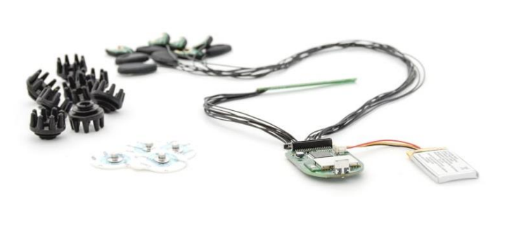
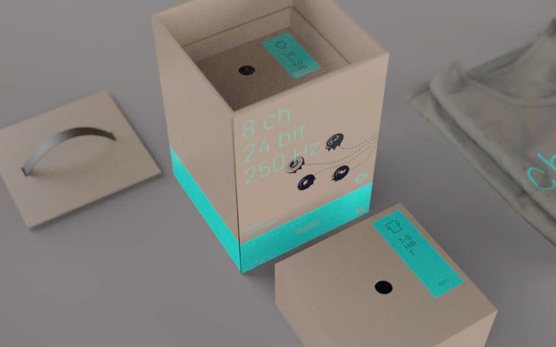
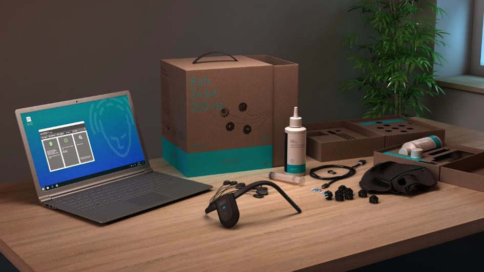

# Unicorn Suite Hybrid Black User Manual
This repository is the User Manual for Unicorn Brain Interface Hybrid Black.

Copyright © 2021 g.tec neurotechnology GmbH Austria

For more information, visit: [Unicorn Brain Interface webpage](www.unicorn-bi.com)

Contact email: hello@unicorn-bi.com

### [Glossary](Glossary/glossaryInformation.md)

### [Safety Notice](Safety/safetyNotice.md)

# Introduction
The Unicorn Brain Interface is a consumer grade biosignal amplifier kit. It allows developers, artists and makers to integrate signals from the human body within their projects – ranging from simple display of the signals to designing and controlling attached devices and interacting with artistic installations, toys, computer programs or apps and more. The Unicorn Brain Interface acquires the EEG from eight Unicorn Hybrid EEG Electrodes. The Unicorn Brain Interface consists of the Unicorn Brain Interface Hybrid Black, Unicorn C Size M, Unicorn Hybrid EEG Electrodes, Unicorn USB Charging Cable and a Unicorn Bluetooth dongle to acquire data on a computer. The Unicorn Suite is the software environment, consisting of standalone applications and APIs to interface the Unicorn Brain Interface, acquire and process data and to perform BCI paradigms.

## Highlights
- EEG recordings without cable connection via radio signal
- Bluetooth 2.1 interface
- Hybrid electrodes for wet and dry measurements
- 8 DC-coupled analog input channels with 24 Bit resolution
- sampling rate of 250 Hz per channel
- oversampling to achieve a high signal-to-noise ratio
- input sensitivity of ± 750 mV
- 3-axis accelerometer
- 3-axis gyroscope

## Intended use
The Unicorn Brain Interface is intended for use in non-medical environment for non-medical applications. The Unicorn Brain Interface is used by developers, artists, makers and gamers in the user’s environment.

## Release notes
|Version Name|Version Number|Date|Change|
|-|-|-|-|
|Unicorn Hybrid Black|1.18.00|11/15/21|Initial Release|

## Conditions of use
### Operation and storage

 Temperature: +5 to +40 °C

 Relative humidity: 25 to 80 %, non-condensing

 Atmospheric pressure: 700 to 1060 hPa

# Unicorn Hybrid Black

<table>
    <tr>
        <th>Bundle components</th>
        <th>Quantity</th>
    </tr>
    <tr>
        <td>Unicorn Brain Interface Hybrid Black	</td>
        <td>1</td>
    </tr>
    <tr>
        <td>Unicorn USB Charging Cable	</td>
        <td>1</td>
    </tr>
    <tr>
        <td>Unicorn Hybrid EEG Electrodes	</td>
        <td>8</td>
    </tr>
    <tr>
        <td>Unicorn Sticky Electrodes</td>
        <td>50</td>
    </tr>
    <tr>
        <td>Unicorn Cap Size M	</td>
        <td>1</td>
    </tr>
    <tr>
        <td>Unicorn Bluetooth Dongle</td>
        <td>1</td>
    </tr>
    <tr>
        <td>Unicorn Box	</td>
        <td>1</td>
    </tr>
        <tr>
        <td>Unicorn Suite Hybrid Black</td>
        <td>1</td>
    </tr>
</table>

 

## [Unicorn Brain Interface Hybrid Black](/TechnicalSpecifications/unicornBrainInterfaceHybridBlack.md)

# Unicorn Nake BCI
The Unicorn Naked BCI allows you to build your own EEG head-set and BCI applications with high-performance hardware and open-source tools within hours. The only difference from the Unicorn Hybrid Black is that the Unicorn Naked BCI comes without a casing.

<table>
    <tr>
        <th>Bundle components</th>
        <th>Quantity</th>
    </tr>
    <tr>
        <td>Unicorn Naked BCI </td>
        <td>1</td>
    </tr>
    <tr>
        <td>Unicorn USB Charging Cable</td>
        <td>1</td>
    </tr>
    <tr>
        <td>Unicorn Hybrid EEG Electrodes</td>
        <td>8</td>
    </tr>
    <tr>
        <td>Unicorn Sticky Electrodes</td>
        <td>50</td>
    </tr>
    <tr>
        <td>Unicorn Bluetooth Dongle</td>
        <td>1</td>
    </tr>
    <tr>
        <td>Unicorn Box</td>
        <td>1</td>
    </tr>
    <tr>
        <td>Unicorn Suite Hybrid Black</td>
        <td>1</td>
    </tr>
</table>

 

 

# General notes:

## Classification
- Protection against mechanical distortion and liquids: IP40
- Operation mode: S1 (Permanent operation)

## Transportation and storage conditions
The Unicorn Brain Interface can be stored at temperatures between –20° to +45° Celsius. The relative humidity must be between 25 % and 80 %. If there is any condensed water, wait until it disappears before use (wait at least 1 h in a heated room).

## Location details
Do not use the Unicorn Brain Interface near a heating system or directly in the sun. During operation, the outside temperature should be between +5 Celsius and +35 Celsius and the air pressure between 700 and 1060 hPa.

## Wast disposal details
Bring the Unicorn Brain Interface to a recycling center or sent it back to the manufacturer.

## Warranty
Warranty in the EU is 6 month and 30 days in other countries for the Unicorn Brain Interface. The Unicorn Hybrid EEG Electrodes, the Unicorn Gel and the disposable Unicorn Sticky Electrodes are consumables. Only use parts from g.tec to operate the Unicorn Brain Interface. Warranty is invalidated if anyone except a g.tec employee opens or disassembles any components of the Unicorn. Warranty only applies for properly used devices. Please note that any damage resulting from improper treatment of the system will not be covered by the warranty. This may include broken, kinked or damaged wires and cables, damaged isolators and enclosures

# Declaration of Conformity
The declaration of conformity is available on request.

# Unicorn Brain Interface Packaging

 

 

# [Technical Specifications](/TechnicalSpecifications/technicalSpecifications.md)

# Electromagnetic compatibility (EMC)
The EMC declaration is available on request.

# Software System Requirements
Minimum hardware requirements to run the Unicorn Suite.

<table>
    <tr>
        <th>Hardware</th>
        <th>Properties</th>
    </tr>
    <tr>
        <td>CPU</td>
        <td>2 GHz or faster processor</td>
    </tr>
    <tr>
        <td>Hard disk</td>
        <td>20-30 GB</td>
    </tr>
    <tr>
        <td>RAM</td>
        <td>4 GB</td>
    </tr>
        <tr>
        <td>Bluetooth</td>
        <td>Bluetooth Adapter with Bluetooth 2.1 + EDR support</td>
    </tr>
</table>

Minimum software requirements to run the Unicorn Suite.

<table>
    <tr>
        <th>Software</th>
        <th>Properties</th>
    </tr>
    <tr>
        <td>Operating System</td>
        <td>Windows 10 Pro   English 64-bit</td>
    </tr>
    <tr>
        <td>PDF Reader</td>
        <td>Acrobat Reader DC 2015</td>
    </tr>
</table>

# [Installation](/Installation/installation.md)

# [Software Prerequisites](/Installation/softPrerequisites.md)
## Programming Interfaces
[Unicorn APIs](https://github.com/unicorn-bi/Unicorn-Hybrid-Black-Windows-APIs) 

&nbsp;&nbsp;&nbsp;[Unicorn C API](https://github.com/unicorn-bi/Unicorn-Hybrid-Black-Windows-APIs/blob/main/c-api/unicorn-c-api.md) 

&nbsp;&nbsp;&nbsp;[Unicorn .NET API](https://github.com/unicorn-bi/Unicorn-Hybrid-Black-Windows-APIs/blob/main/dotnet-api/unicorn-dotnet-api.md) 

&nbsp;&nbsp;&nbsp;[Unicorn Python API](https://github.com/unicorn-bi/Unicorn-Hybrid-Black-Windows-APIs/blob/main/python-api/unicorn-python-api.md) 

&nbsp;&nbsp;&nbsp;[Unicorn Simulink Interface](https://github.com/unicorn-bi/Unicorn-Hybrid-Black-Windows-APIs/blob/main/simulink-interface/unicorn-simulink-interface.md) 

[Unicorn Network Interfaces](https://github.com/unicorn-bi/Unicorn-Network-Interfaces-Hybrid-Black/tree/main) 

&nbsp;&nbsp;&nbsp;[Unicorn LSL](https://github.com/unicorn-bi/Unicorn-Network-Interfaces-Hybrid-Black/tree/main/LSL) 

&nbsp;&nbsp;&nbsp;[Unicorn UDP](https://github.com/unicorn-bi/Unicorn-Network-Interfaces-Hybrid-Black/tree/main/UDP) 

## Applications

[Unicorn Bandpower](https://github.com/unicorn-bi/Unicorn-Bandpower-Hybrid-Black) 

[Unicorn Blondy Check](https://github.com/unicorn-bi/Unicorn-Hybrid-Black-Windows-APIs) 