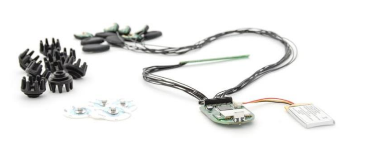
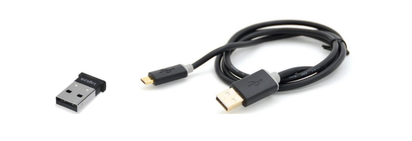

# Unicorn Nake BCI
The Unicorn Naked BCI allows you to build your own EEG head-set and BCI applications with high-performance hardware and open-source tools within hours. The only difference from the Unicorn Hybrid Black is that the Unicorn Naked BCI comes without a casing.

<table>
    <tr>
        <th>Bundle components</th>
        <th>Quantity</th>
    </tr>
    <tr>
        <td>Unicorn Naked BCI </td>
        <td>1</td>
    </tr>
    <tr>
        <td>Unicorn USB Charging Cable</td>
        <td>1</td>
    </tr>
    <tr>
        <td>Unicorn Hybrid EEG Electrodes</td>
        <td>8</td>
    </tr>
    <tr>
        <td>Unicorn Sticky Electrodes</td>
        <td>50</td>
    </tr>
    <tr>
        <td>Unicorn Bluetooth Dongle</td>
        <td>1</td>
    </tr>
    <tr>
        <td>Unicorn Box</td>
        <td>1</td>
    </tr>
    <tr>
        <td>Unicorn Suite Hybrid Black</td>
        <td>1</td>
    </tr>
</table>

 

 

