# Unicorn Suite Hybrid Black

[Software System Requirements](#software-system-requirements)<br/>
&nbsp;&nbsp;&nbsp;[Install Unicorn Suite Hybrid Black](#install-unicorn-suite-hybrid-black) <br/>
&nbsp;&nbsp;&nbsp;[Uninstall Unicorn Suite Hybrid Black](#uninstall-unicorn-suite-hybrid-black)
[Installation](#installation)<br/>
[Software Prerequisites](#soft-prerequisites)<br/>
&nbsp;&nbsp;&nbsp;&nbsp;&nbsp;&nbsp;[Bluetooth Confuguration](#bluetooth-configuration)<br/>
&nbsp;&nbsp;&nbsp;&nbsp;&nbsp;&nbsp;[Switch Bluetooth Dongle](#switch-bluetooth-dongle)<br/>
&nbsp;&nbsp;&nbsp;&nbsp;&nbsp;&nbsp;[Disable Bluetooth Power Adaptor](#disable-bluetooth-power-saving-mode)<br/>
&nbsp;&nbsp;&nbsp;[Optimize the Power Plan](#optimize-the-power-plan)<br/>
[Apps](#apps)<br/>
[Development Tools](#development-tools)<br/>
[Licensing](#licensing)<br/>
&nbsp;&nbsp;&nbsp;[Lost License](#lost-license)<br/>
[Upgrade from Unicorn Suite Hybrid Black 1.18.00 to Unicorn Suite Hybrid Black 1.24.00](#upgrade-from-unicorn-suite-hybrid-black-11800-to-unicorn-suite-hybrid-black-12400)

# Software System Requirements
Minimum hardware requirements to run the Unicorn Suite.
<p align="center">
<table>
    <tr>
        <th><span style="font-size: larger;">Hardware</span></th>
        <th><span style="font-size: larger;">Properties</span></th>
    </tr>
    <tr>
        <td>CPU</td>
        <td>2 GHz or faster processor</td>
    </tr>
    <tr>
        <td>Hard disk</td>
        <td>20-30 GB</td>
    </tr>
    <tr>
        <td>RAM</td>
        <td>4 GB</td>
    </tr>
        <tr>
        <td>Bluetooth</td>
        <td>Bluetooth Adapter with Bluetooth 2.1 + EDR support</td>
    </tr>
</table>
</p>

Minimum software requirements to run the Unicorn Suite.
<p align="center">
<table>
    <tr>
        <th><span style="font-size: larger;">Software</span></th>
        <th><span style="font-size: larger;">Properties</span></th>
    </tr>
    <tr>
        <td>Operating System</td>
        <td>Windows 10 Pro <br/> English<br/>64-bit</td>
    </tr>
    <tr>
        <td>PDF Reader</td>
        <td>Acrobat Reader DC 2015</td>
    </tr>
</table>
</p>

# Installation
The following section describes how to install Unicorn Suite.

## Install Unicorn Suite Hybrid Black
Perform the following steps for installation:
1. If there is an old version of the Unicorn Suite package on the computer, please uninstall it.
2. Close all running applications.
3. Open the Unicorn Suite directory, select the correct directory for the architecture of the PC (Win64). To install the Unicorn Suite, run setup.exe. If setup asks you for installation of the .NET Framework, confirm the dialog by clicking the Accept button. The installer will install the .NET Framework.
4. Follow the instructions on the screen. If User Account Control is turned on, additional dialogs may ask for permission. Confirm the dialogs to allow installation of the Unicorn Suite software through User Account Control.
    <p align="center">
    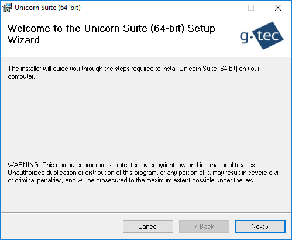<br/>
    </p>
5. Choose the installation folder (default is ```C:\Program Files\gtec\```) where the install routine copies all necessary driver files and press Next.
6. Follow the instructions on the screen. When the following window informs you about completion of the installation, click Close to complete.

## Uninstall Unicorn Suite Hybrid Black
Remove Unicorn Suite using the standard uninstall process of Windows accessed via the Control Panel.

# Software Prerequisites

## Bluetooth Configuration
Most computers are delivered with an internal Bluetooth adapter. The Unicorn Brain Interface is tested and delivered with a recommended Unicorn Bluetooth adapter. To avoid data loss and unexpected behavior, the Unicorn Brain Interface should be used with the Unicorn Bluetooth dongle. Insert the Unicorn Bluetooth dongle into an USB slot and open the Unicorn Suite. Open the “My Unicorn” tab.
- If the Bluetooth symbol is colored green, the recommended Bluetooth adapter is in use and configured properly.
- If the Bluetooth symbol is blinking red, either the wrong Bluetooth adapter is used or it is not configured correctly.
- The delivered Bluetooth dongle should be named “CSR8510 A10”.
<p align="center">
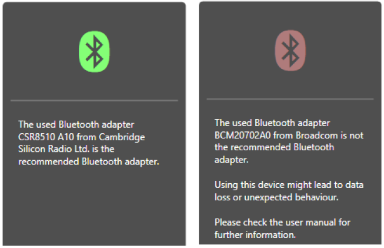<br/>
</p>

### Switch Bluetooth Dongle
Open the “Device Manager” and go to the Bluetooth section. The Unicorn Bluetooth dongle should be listed as “Generic Bluetooth Radio”. If the Generic Bluetooth Radio symbol features a small warning sign, the Unicorn Brain Interface is not in use or not working properly.

If there are multiple Bluetooth devices, the computer has an internal Bluetooth adapter, which is currently in use. Disable the internal Bluetooth adapter by right clicking the device and selecting “Disable device”. Reinject the Unicorn Bluetooth dongle. The Unicorn Bluetooth dongle should be used now.
<p align="center">
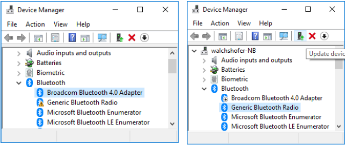<br/>
</p>

### Disable Bluetooth Power Saving Mode
Open the Unicorn Suite and go to the “My Unicorn” tab if the delivered Bluetooth dongle is in use. The delivered Bluetooth dongle should be named “CSR8510 A10”. If the delivered dongle is in use but still blinking red, the power saving mode is enabled.
<p align="center">
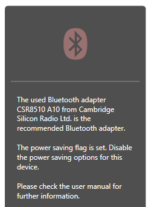<br/>
</p>
Open the “Device Manager” and go to the Bluetooth section. Open the Bluetooth properties of the “Generic Bluetooth Radio”. Go to the “Power Management” tab. Deselect the “Allow the computer to turn off this device to save power” option to disable the power saving mode.
<p align="center">
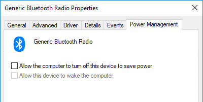<br/>
</p>

**Note:**
Do not use any other Bluetooth dongle than the Unicorn Bluetooth dongle.

## Optimize the Power Plan
To ensure that the computer does not go to sleep or hibernate while acquiring data or performing a paradigm, the “Power Options” should be optimized. Modify the power plan settings as following: 
<p align="center">
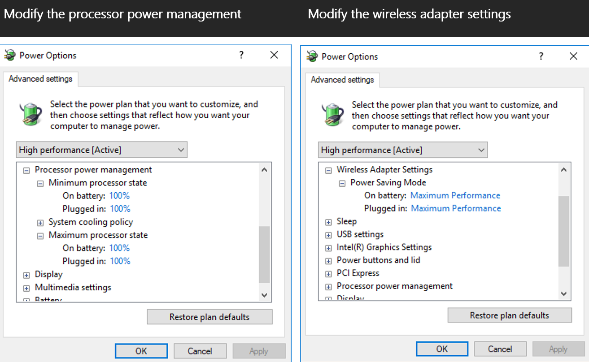<br/>
</p>
<p align="center">
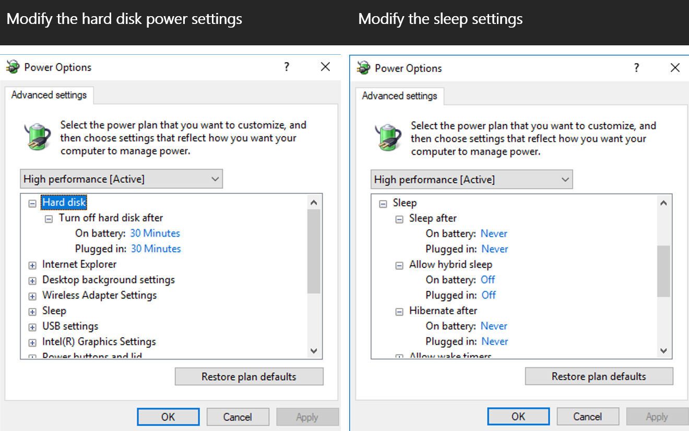<br/>
</p>
<p align="center">
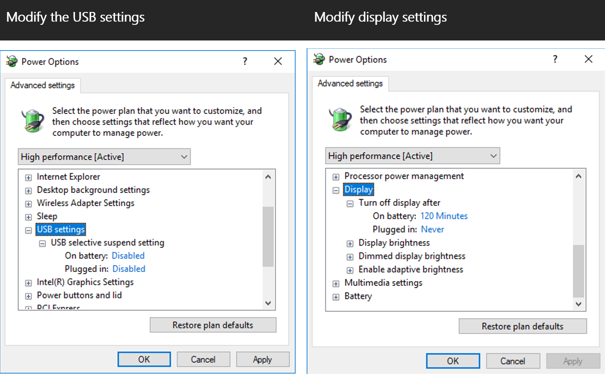<br/>
</p>

# Apps

The Apps tab features available standalone applications for the Unicorn Brain Interface. Applications can be used if a valid license is present. See chapter '[Licensing](#licensing)' for more information about the licensing system. Applications can be started with a paired Unicorn Brain Interface and will establish the connection to the device automatically. See chapter [My Unicorn](#my-unicorn) for more information about pairing with Unicorn Brain Interfaces and setting up the system environment. 

<p align="center">
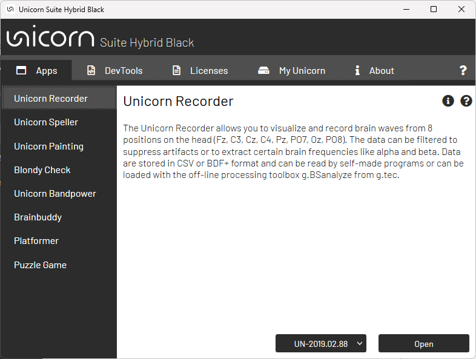<br/>
</p>

## Installing apps

1. Download the app
<p align="center">
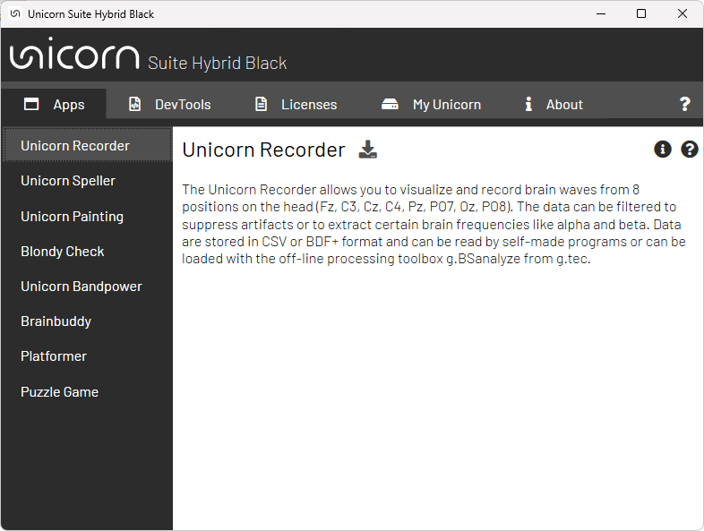<br/>
</p>

<p align="center">
<br/>
</p>

2. Click the play button to install the app
<p align="center">
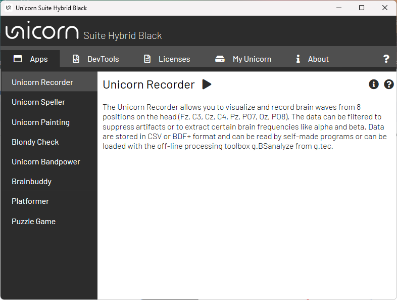<br/>
</p>

## Updating apps

# Development Tools

The DevTools tab features application programming interfaces (API) for the Unicorn. Free APIs can be opened directly by clicking the “Open” button. The API library folder will be opened automatically. Licensed APIs require a license to be unlocked. Follow section [Licensing](#licensing) to get more information about the licensing system. 

<p align="center">
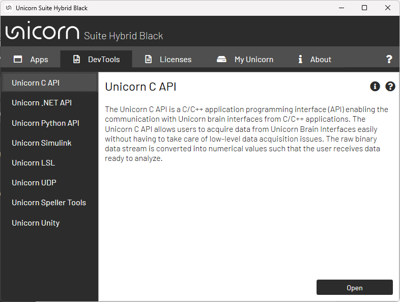<br/>
</p>

## Installing development tools

1. Download the development tool
<p align="center">
<br/>
</p>

<p align="center">
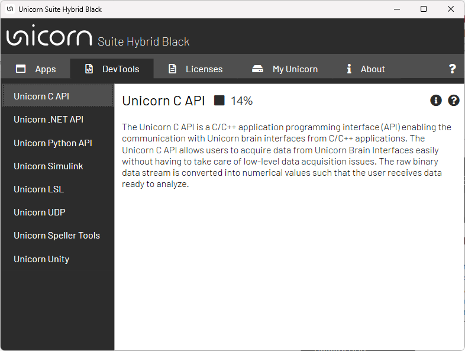<br/>
</p>

2. Click the play button to install the development tool
<p align="center">
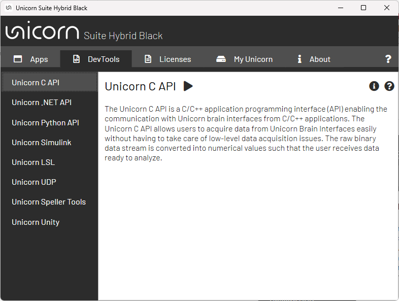<br/>
</p>

# Licensing

The “Licenses” tab manages licenses for applications and development tools. Licenses can be purchased from [www.gtec.at](https://www.gtec.at). It is possible to activate, deactivate and check the status of licenses within the “Licenses” dialog. After purchase, licenses are delivered via e-mail. All information required to activate a license is delivered with the e-mail. 

<p align="center">
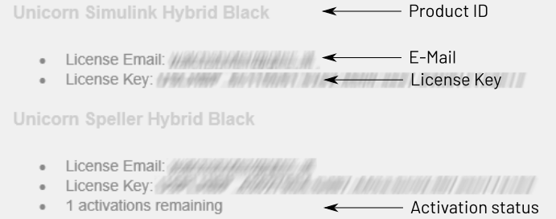<br/>
</p>

Click “Add license” to activate a license key. Use “Product Id”, “License key” and “License Email” from the received email to complete the dialog. Click “Activate” to enable the license. If the activation succeeded, the license is listed as installed license. Check your internet connection and license information if the license key could not be activated. 

If the license server is reachable, licenses are refreshed whenever the Unicorn Suite is started. Applications and development tools can also be used offline if the license was refreshed within one week. Afterwards, an online license refresh is required. The License expiration date determines the expiration date of the license for a specific product. 

<p align="center">
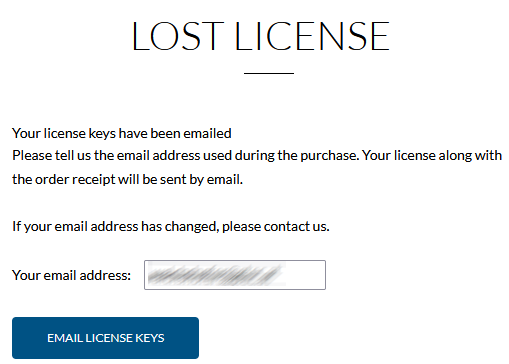<br/>
</p>

<p align="center">
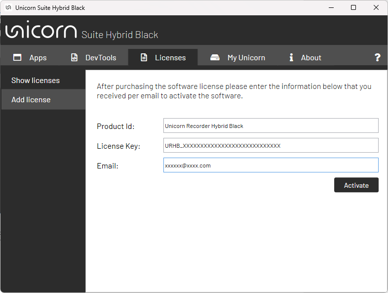<br/>
</p>

To deactivate a license, select the product to deactivate from the installed licenses list and click “Deactivate”. The license will be removed from the installed licenses list if the deactivation succeeded. 

<p align="center">
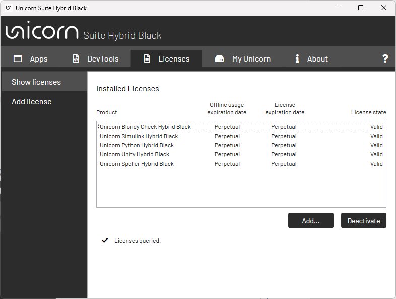<br/>
</p>

## Lost License

You can resend the license key email using the '[Lost License Tool](https://www.gtec.at/lost-license/)' if you've lost you'r license key email.

# My Unicorn

<p align="center">
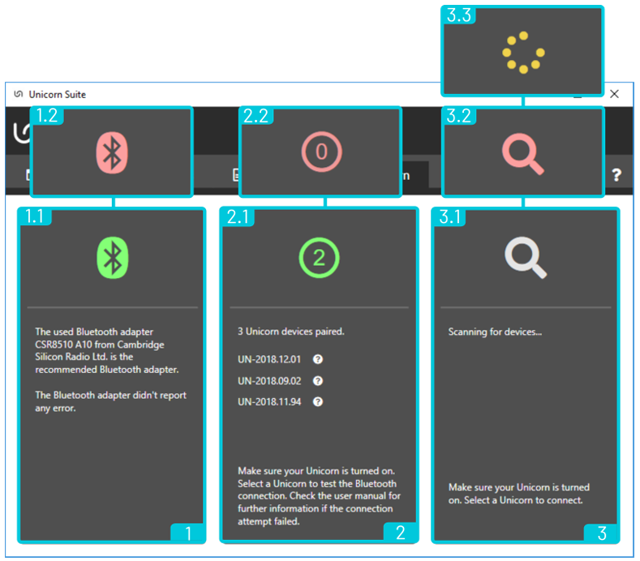<br/>
</p>

1 - This panel displays the Bluetooth adapter information of the Bluetooth device that is currently in use. The Unicorn Brain Interface features a Bluetooth module for data communication. Therefore, you must install and use the Bluetooth dongle delivered with the Unicorn Brain Interface. Please insert the Bluetooth dongle and wait until the driver of the Unicorn Brain Interface is installed.

1.1 - A green Bluetooth symbol indicates that the delivered Bluetooth adapter is in use. Using the delivered Bluetooth adapter is required to ensure a proper interaction between Unicorn hard- and software. 

1.2 - A red blinking Bluetooth symbol indicates that there is either an invalid or no Bluetooth adapter available for use. Using an invalid Bluetooth adapter might lead to data loss or unexpected behavior. Please check if the delivered Bluetooth dongle is inserted, installed and in use. If you are using a PC with an internal Bluetooth interface, it is very likely that the computer is still using the internal Bluetooth adapter instead of the recommended Unicorn Bluetooth adapter. You have to disable the internal Bluetooth adapter before the delivered Bluetooth adapter is inserted. Modifications of the Bluetooth adapter can be performed in Windows “Device Manager”.

2 - This panel displays all paired Unicorn brain interfaces.

2.1 - The green circle indicates that there are paired Unicorn Brain Interfaces ready for use. The number in the circle represents the number of paired Unicorn Brain Interfaces.

2.2 - A red blinking symbol indicates that no Unicorn Brain Interface is paired and ready for use. Unicorn Brain Interfaces can be paired in the Unicorn Suite directly or in the Windows “Bluetooth and other devices settings”.

3 - This panel is displaying unpaired Unicorn Brain Interfaces which can be paired.

3.1 - A grey blinking loupe symbol indicates that the Unicorn Suite is searching for available Unicorn Brain Interfaces. Available Unicorn Brain Interfaces will be listed in the panel and can be selected to be paired. 

3.2 - A red blinking loupe symbol indicates that the Unicorn Brain Interface discovery failed. Please check if the delivered Bluetooth dongle is inserted, installed and in use.

3.3 - A yellow blinking symbol appears after a discovered Unicorn brain interface was selected for 
pairing. Please follow the Windows instructions that will pop up and allow the Unicorn Brain 
Interface to get paired. 

# Upgrade from Unicorn Suite Hybrid Black 1.18.00 to Unicorn Suite Hybrid Black 1.24.00

**Note:**
License keys should not be affected by the upgrade process. They remain on the system. It is not required to deactivate them before upgrading 'Unicorn Suite Hybrid Black'.

1. Remove Unicorn Suite using the standard uninstall process of Windows accessed via the Control Panel.

<p align="center">
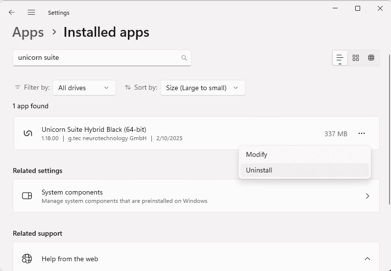<br/>
</p>

2. Download the latest Unicorn Suite Hybrid Black release from '[Unicorn Suite Hybrid Black - Releases](https://github.com/unicorn-bi/Unicorn-Suite-Hybrid-Black-User-Manual/releases)

3. Install Unicorn Suite Hybrid Black as described in the '[Installation](#installation)' section.

4. Open Unicorn Suite Hybrid Black

5. Download and install apps as described in section '[Installing apps](#installing-apps)' and '[Installing development tools](#installing-development-tools)'.