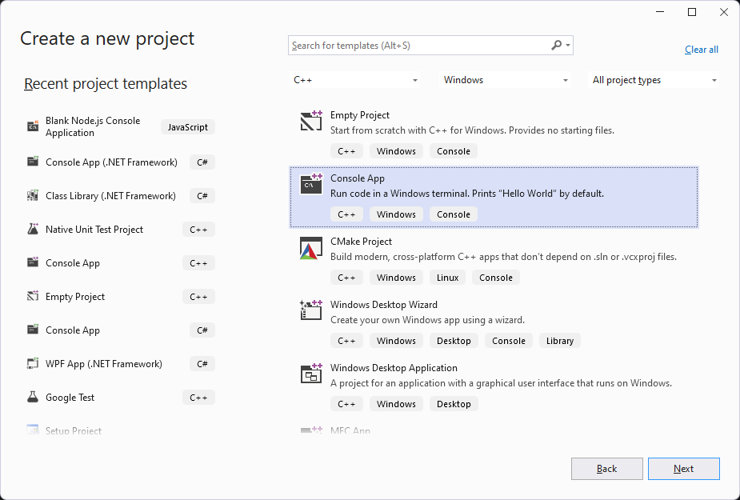
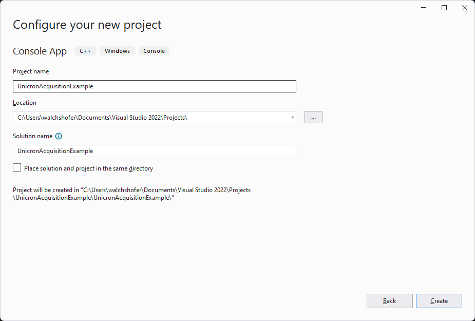
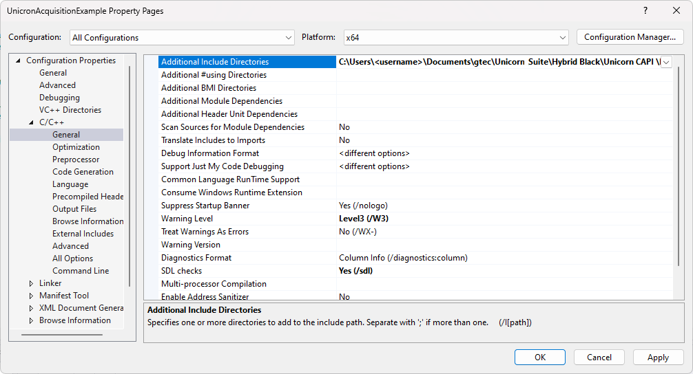
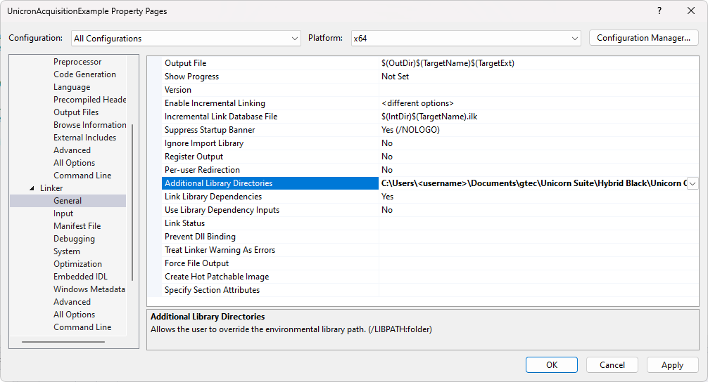
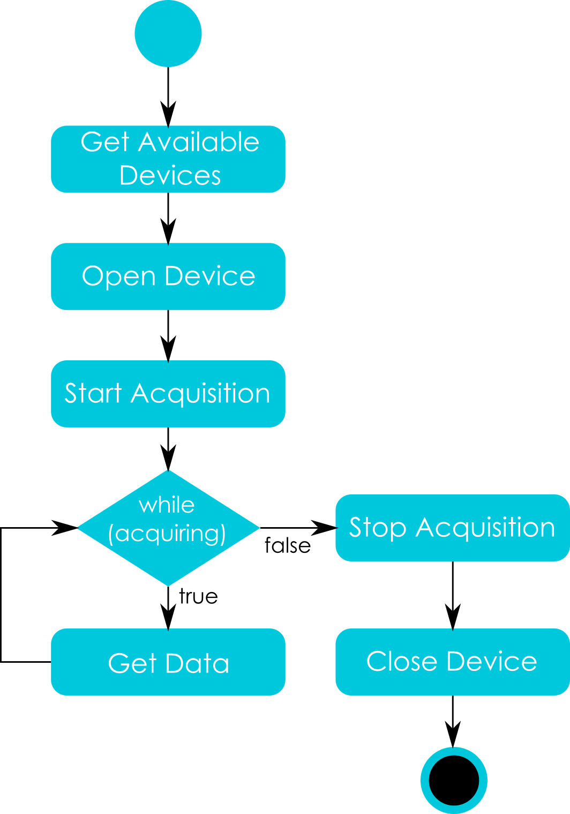

# UNICORN C API
The Unicorn C API is a C/C++ application programming interface (API) enabling the communication with 
Unicorn brain interfaces from C/C++ applications. The Unicorn C API allows users to acquire data from 
Unicorn Brain Interfaces easily without having to take care of low-level data acquisition issues. The raw 
binary data stream is converted into numerical values such that the user receives data ready to analyze.

## Requirements
| Software        | Properties          |
| --------------- | ------------------- |
| Visual Studio   | Microsoft Visual Studio 2015 <br/> Desktop development for the C++ programming 
language |

## Files on your computer
By default, the Unicorn C API library is installed into the Documents folder.
| Path        | Description          |
| --------------- | ------------------- |
| C:\Users\<username>\Documents\gtec\Unicorn Suite\Hybrid Black\Unicorn CAPI | Standard installation folder for the Unicorn C API library |

## Using the Unicorn C Api
There are several possibilities to refer to the Unicorn C API files from your individual project
- Copy the Unicorn.lib and Unicorn.h to your project folder and add both files to your project.
- Add the library folder (by default C:\Users\<username>\Documents\gtec\Unicorn Suite\Hybrid 
Black\Unicorn CAPI\Examples) to the search path in your IDE and add Unicorn.lib and Unicorn.h to 
your project.
## Setting up a project using Visual Studio 2022
1. Open Visual Studio 2022.
2.  Create a new C++ Win32 Console application (File → New → Project → Visual C++).
<br/><br/>

<br/><br/>


3. Ensure that 64-bit is selected as target platform for the project.
4. Open the project properties dialog (Project → Properties).
5. Open the C/C++ Settings (Configuration Properties → C/C++ → General).
6. Add the path of the Unicorn C API (by default C:\Users\<username>\Documents\gtec\Unicorn 
Suite\Unicorn CAPI\Hybrid Black\Lib) to the “Additional Include Directories”.
<br/><br/>


7. Open the Linker Settings (Configuration Properties → C/C++ → General).
8. Add the path of the Unicorn C API (by default C:\Users\<username>\Documents\gtec\Unicorn Suite\Hybrid Black\Unicorn CAPI \Lib) to the “Additional Library Directories”.
<br/><br/>
<p align="center">
<br/>
</p>

9. Add the header file and the library file of the Unicorn C API as follows:

```#include "stdafx.h"
// Include unicorn header-file.
#include "unicorn.h"
// Include unicorn lib.
#pragma comment(lib, "Unicorn.lib")
int main()
{
 // Insert your code here.
 return 0;
}
```

## Command Order
To perform a data acquisition using the Unicorn C API, a defined command execution order is required.
<p align="center">
<br/>
</p>
1. Before connecting to a Unicorn Brain Interface, it is possible to check the operating environment 
of Unicorn Brain Interfaces and to discover available Unicorn Brain Interfaces.
2. A connection has to be established to communicate with the Unicorn brain interface. This can be 
performed by calling Open Device. If a Unicorn Brain Interface handle unequal to Null is received,
the connection attempt was executed successfully. After connecting to a Unicorn Brain Interface, it 
is possible to interact with the Unicorn Brain Interface and call all functions that require a 
UNICORN_HANDLE. For example, it is possible to read the current configuration of the Unicorn 
Brain Interface, set a new configuration or start data acquisition.
3. To start data acquisition, Start Acquisition must be called. After calling Start Acquisition, the 
Unicorn Brain Interface is set into acquisition mode and is continuously sending data.
4. Therefore, it is required to read the incoming data stream continuously by calling Get Data within 
an acquisition loop. Other API calls are not allowed while data acquisition is running.
5. To stop data acquisition, Stop Acquisition must be called. The Unicorn Brain Interface will terminate 
the data stream. The Unicorn Brain Interface is still connected. It is possible to interact with the 
Unicorn Brain Interface and call all functions that require a UNICORN_HANDLE.
6. To disconnect from a Unicorn Brain Interface, Close Device must be called. Afterwards, it is not 
possible to interact with the Unicorn Brain Interface anymore. The Unicorn Brain Interface has to 
be opened again for interaction.